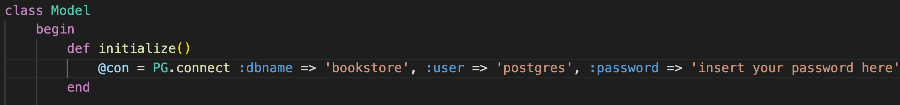

# LookInnaBook
Your go-to command-line bookstore. 📚🌱

## Technologies
  - Ruby
  - PostgreSQL

## How to Run the LookInnaBook Command-Line Application
1. Clone this GitHub Repository
2. Make sure you have PostgreSQL installed and configured on your machine.
  You can download it [here](https://www.postgresql.org/download/) if you don't already have it.
3. Create a fresh PostgreSQL database with the name 'bookstore'.  
   - You can do this in PgAdmin or with the command `CREATE DATABASE bookstore`
4. Use the `DDL.sql` file in this repository to create the tables in the bookstore database.
5. Use the `smallRelationsInsertFile.sql` file in this repository to seed the database with some sample data.
6. In the `initialize()` method in the`model.rb` file in the repository change the password to your PostgreSQL password where it says `'insert your password here'`

7. In the terminal run `bundle install` to install all dependencies required to run this project
8. In the terminal run `rake` to begin using the application.

## How to use LookInnaBook
Login or create an account. Here is the login menu:  


   - Select 1 to login. Feel free to use the accounts below:
     ```
     account 1 (customer account)
     username: cherryIrma
     password: huskyape
     
     account 2 (owner account)
     username: senatorHanna
     password: resistmaterial
     ```
Select 2 to login create an account. Enter the information you are prompted to enter.  


  
## Customer Functionality
### Search Books
Enter any search query to explore our collection of books. For example: 
      
  After you search for a book, you can add the book to your cart, view more details on it or make another search.  
  Please note that when you select a book you must identify it by the identifying integer on its right hand side wrapped in square brackets. For example:
  
### Track an Order
You may track an order by entering the order_id associated with your order.
  
### Checkout
Displays all books in your cart and your purchase information. Prompts you to check out.


    
## Admin Functionality
### Add a book
You may add a book to your store's offering by entering the details of the book and the quantity availiable.  


### Remove a book
You may remove a book to your store's offering by entering the isbn of the book.


### View Reports
When you choose to view reports, you will be met with a report menu. Select the report you would like to view.
Note: These reports are based on a database that has been used for several purchases. To see meaningful reports you will have to buy a few books with the customer account first
  
For example, here is the report that displays sales by genre.  
  
Here is the report that display sales by author.  
  
Here is the report that displays total sales.  
  


